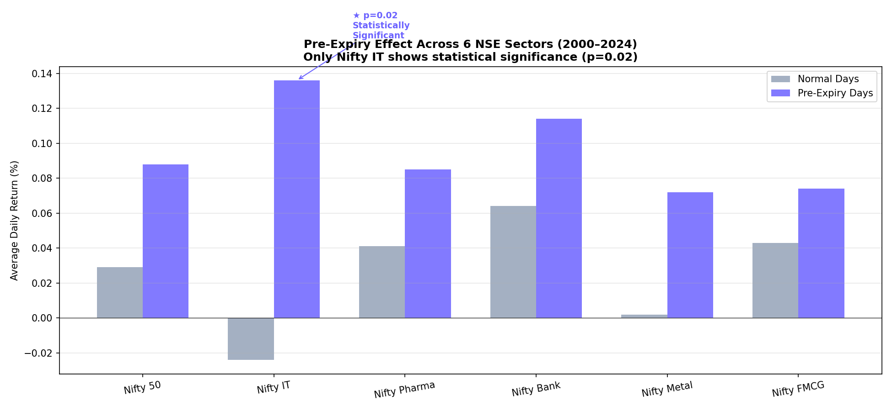

# NSE Pre-Expiry Effect: A Cross-Sector Analysis

## Research Question

Do NSE stocks generate higher returns in the 2 trading days
before Thursday F&O expiry compared to normal trading days?

## Hypothesis

Derivatives traders close or adjust positions before Thursday
expiry, creating buying pressure that elevates prices in the
1-2 days prior. This effect should be strongest in sectors
with the highest options open interest.

## Data

- Source: NSE historical data (Kaggle)
- Period: 2000–2024
- Indices: Nifty 50, IT, Pharma, Bank, Metal, FMCG

## Methodology

1. Calculated daily percentage returns using pct_change()
2. Removed weekend data anomalies
3. Flagged 2 trading days before each Thursday as pre-expiry
4. Compared pre-expiry vs normal day average returns
5. Statistical significance tested via independent t-test (scipy)

## Results

| Sector       | Normal Return | Pre-Expiry Return | P-Value  | Significant |
| ------------ | ------------- | ----------------- | -------- | ----------- |
| Nifty 50     | 0.029%        | 0.088%            | 0.11     | No          |
| Nifty IT     | -0.024%       | 0.136%            | **0.02** | **Yes ★**   |
| Nifty Pharma | 0.041%        | 0.085%            | 0.24     | No          |
| Nifty Bank   | 0.064%        | 0.114%            | 0.35     | No          |
| Nifty Metal  | 0.002%        | 0.072%            | 0.34     | No          |
| Nifty FMCG   | 0.043%        | 0.074%            | 0.41     | No          |



## Key Finding

The pre-expiry effect is directionally consistent across all
6 sectors but statistically significant only in Nifty IT
(p=0.02). IT stocks have the highest options open interest
relative to market cap on NSE — derivatives positioning
creates stronger and more consistent buying pressure in IT
than in other sectors.

## Limitations

- Does not separate weekly vs monthly expiry cycles
- Pre-2019 data predates NSE weekly expiry introduction
- Does not control for macroeconomic regime changes
- Single t-test does not account for return autocorrelation

## How to Run

```bash
pip install pandas scipy matplotlib
python nifty50.py
```
