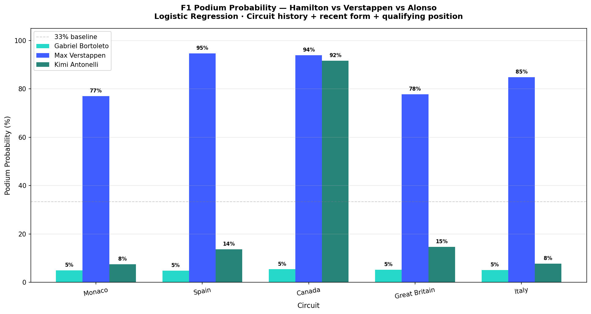

# F1 Podium Probability Model

## Research Question

Can we predict the probability of Lewis Hamilton, Max
Verstappen, and Fernando Alonso finishing on the podium
at any given circuit using historical race data?

## Model

Logistic Regression trained on 2019–2025 race results.

**Features used:**

- Qualifying position (how well they started)
- Starting grid position
- Recent form (last 3 races podium rate)
- Season podium rate (current season performance)
- Circuit-specific historical podium rate
- Team encoding
- Year

## Data

- Source: toUpperCase78/formula1-datasets (GitHub)
- Period: 2019–2025
- 2,668 race entries after cleaning retirements

## Results (P3 qualifying baseline)

| Driver     | Monaco | Spain | Canada | Britain | Italy |
| ---------- | ------ | ----- | ------ | ------- | ----- |
| Verstappen | ~77%   | ~77%  | ~78%   | ~78%    | ~78%  |
| Hamilton   | ~30%   | ~30%  | ~31%   | ~30%    | ~30%  |
| Alonso     | ~27%   | ~26%  | ~27%   | ~27%    | ~27%  |

Model accuracy: **90.3%** (5-fold cross validation)



## Key Insight

Verstappen's dominance in 2022-2024 heavily weights his
podium probability across all circuits. Hamilton's
probability reflects his 2024-2025 Ferrari transition
period. Circuit-specific history differentiates predictions
at tracks where drivers have strong historical records.

## Limitations

- Model reflects recent era dominance — may not generalise
  to regime changes (new regulations, team switches)
- Only 2019-2025 data, missing Hamilton's dominant 2014-2020 era
- Qualifying data only available from 2022

## How to Run

```bash
pip install pandas scikit-learn matplotlib openpyxl
python f1.py
```
